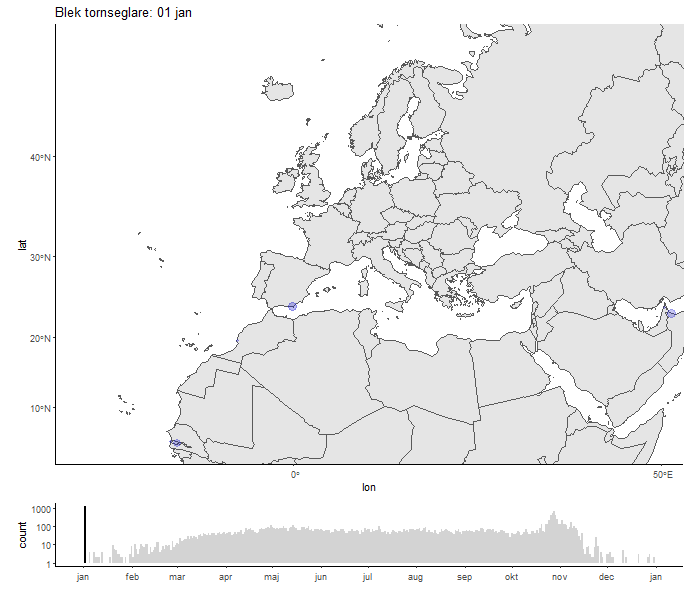
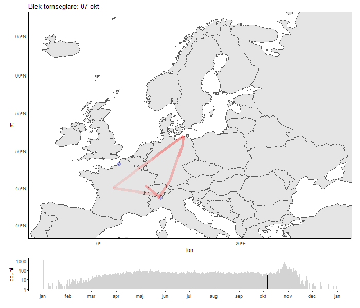

## Hela Europa, Afrika och Asien

```{r echo = F}



```


## Endast nordvästra Europa. 

```{r echo = F}



```

```{r packages, message = F}

library(pacman)

p_load(tidyr, sf, rgbif, ggplot2, rnaturalearth, rnaturalearthdata, stringr, zoo, magick, giscoR, mapview, gridExtra, scales, grid, gtable)

#world <- ne_countries(scale = "medium", returnclass = "sf") #Load the background map

# Broken polygons with the above method. See new method below, works fine. 
#https://gis.stackexchange.com/questions/469267/ggplot-and-sf-package-broken-polygons-after-projection

world.sf <- gisco_get_countries(region = c("Asia", "Europe", "Africa"))

world  <- st_cast(world.sf, 'MULTILINESTRING') %>%
  st_cast('LINESTRING', do_split=T) %>%
  dplyr::mutate(npts = npts(geometry, by_feature = T)) %>%
  st_cast('POLYGON')
```

Run the code below to get data from GBIF. It may take a while, so I have downloaded the file...

```{r eval = F}

gbif_data <- occ_data(scientificName = "Phylloscopus inornatus", hasCoordinate = T,
                      continent = c("Europe", "Asia"), limit = 50000)

gbif_data_total <- dplyr::bind_rows(gbif_data$Europe$data, gbif_data$Asia$data)

```

Run the code below to load the downloaded data from disk.

```{r, eval=F}

gbif_data_total <- read.delim("C:/projekt/data/0023843-231120084113126_apus_pallidus.csv")
table(!is.na(gbif_data_total$decimalLongitude))
table(!is.na(gbif_data_total$decimalLatitude)) # check for occurrences without coordinates

gbif_data_total <- gbif_data_total[!is.na(gbif_data_total$decimalLongitude),]
gbif_data_total <- gbif_data_total[!is.na(gbif_data_total$decimalLatitude),] # remove occurrences without coordinates

gbif_data_total <- gbif_data_total %>% dplyr::filter(as.numeric(year) >= 1990)


```

```{r, eval=F, include = F}
#There are some funky records with starting date 1 jan and end date 31 dec in Finland and France. They create an ugly flash at new year.
gbif_data_total %>% dplyr::filter(countryCode == "FI")
```

```{r, eval=F}

df <- st_as_sf(gbif_data_total, coords = c("decimalLongitude", "decimalLatitude"), crs=4326) # convert to sf object

```


```{r functions}

# A neat function to "wrap around" the year in order for the tail to carry over day 0. 

shifter <- function(x, n = 1) {
  if (n == 0) x else c(tail(x, -n), head(x, n))
}

year_days <- 1:365

shifter(year_days, 365)[1]

# pmin is a function that compares two vectors and returns the minimum value for each position.
pmin(c(5,4,3,0.1,1),c(5,3,2,2,1))

delay_day <- function(in_day, delay){
  year_days <- 1:365
  shifter <- function(x, n = 1) {
  if (n == 0) x else c(tail(x, -n), head(x, n))
  }
  out <- shifter(year_days, in_day)[delay]
  return(out)
}

```

```{r, eval=F}
#head(df)

# create and convert date
df$date <- as.Date(paste(sep="-",df$year,df$month,df$day))
df$date <- as.Date(substr(df$eventDate,1,10), format="%Y-%m-%d")
df$jdate <- as.numeric(format(df$date, "%j"))


## Have a look, Calle: https://gist.github.com/rafapereirabr/26965dd851debad32ad2e659024ba451

# transform to funny projection (for apus pallidus)
ortho <- paste0('+proj=ortho +lat_0=46 +lon_0=10 +x_0=0 +k_0=1000 +y_0=0 +a=6371000 +b=6371000 +units=m +no_defs')

# create coordinates
df <- df %>% st_transform(crs = ortho)
df <- df %>%
  dplyr::mutate(lon = sf::st_coordinates(.)[,1],
                lat = sf::st_coordinates(.)[,2])

# 
df2 <- df %>% dplyr::select(lon, lat, date, jdate, individualCount)

# occurrences without a specified number of individuals get an abundance of 1. 
table(df2$individualCount, useNA = "ifany")
df2$individualCount[is.na(df2$individualCount)] <- 1
table(df2$individualCount, useNA = "ifany")


df2$alpha1 <- 0.10

df2 <- df2 %>% dplyr::filter(jdate > 1)

df3 <- df2
for (i in 2:5) {
  temp_df <- df2
  temp_df$alpha1 <- 0.10 / i
  #temp_df$jdate <- shifter(year_days, temp_df$jdate)[i-1]
  temp_df$jdate <- sapply(temp_df$jdate, delay_day, delay = i-1)
  df3 <- rbind(df3, temp_df)
}

df3$size <- (log(df3$individualCount) + 1) / 2
#df3 <- as.data.frame(df3)

# df2$alpha1 <- 0.10
# 
# df21 <- df2
# df22 <- df2
# df23 <- df2
# df24 <- df2
# 
# df21$alpha1 <- 0.10/2
# df21$jdate <- df2$jdate+1
# df22$alpha1 <- 0.10/3
# df22$jdate <- df2$jdate+2
# df23$alpha1 <- 0.10/4
# df23$jdate <- df2$jdate+3
# df24$alpha1 <- 0.10/5
# df24$jdate <- df2$jdate+4
# 
# df210 <- rbind(df2,df21,df22,df23,df24)
# 
# df210$size <- (log(df210$individualCount)+1)/2
# 
# df210 <- as.data.frame(df210)

```


```{r runtheloop, eval=F}
ortho <- paste0('+proj=ortho +lat_0=46 +lon_0=10 +x_0=0 +k_0=1000 +y_0=0 +a=6371000 +b=6371000 +units=m +no_defs')


for(i in 51:365){
  plot1 <- ggplot(data = world) +
    geom_sf() +
    coord_sf(crs=ortho, xlim=c(-4000000,4000000), ylim=c(-3000000, 3000000))+
    geom_point(data=df3 %>% dplyr::filter(jdate == i), aes(y=lat, x=lon, alpha=alpha1, size=size), color="mediumblue")+
    #geom_path(data=inorn_lines_west2[rev(shifter(hej, i))[1:50],], aes(x=lon_mean2, y=lat_mean2, 
    #                                                       alpha=pmin(seq(1,0,length.out=50),n_alpha)), #this function compares a 50-part sequence from 1 to 0, and a transformed sample size value that ranges from 1 to 0, and picks the lowest one. 
    #color="red", size=2)+
    #geom_path(data=inorn_lines_east2[rev(shifter(hej, i))[1:50],], aes(x=lon_mean2, y=lat_mean2,
    #                                                         alpha=pmin(seq(1,0,length.out=50),n_alpha)), 
    #color="green", size=2)+
    ggtitle(paste0("Blek tornseglare: ", format(as.Date(as.character(i), "%j"),"%d %b")))+
    scale_alpha(limits=c(0,1))+
    scale_size(limits=c(0.5,4.16))+
    theme_classic()+
    theme(legend.position="none")
  
  plot2 <- ggplot(data = df)+
    geom_histogram(aes(as.Date(jdate, origin = as.Date("2000-01-01")), fill = jdate == i), binwidth=1)+
    #scale_x_continuous(breaks = seq(230, 360, 20))+
    scale_x_date(labels = date_format("%b"), date_breaks = "1 month")+
    scale_y_continuous(trans='log10')+
    scale_fill_manual(values=c("lightgrey", "black"))+
    xlab("")+
    theme_classic()+
    theme(legend.position = "false")
  #plot3 <- grid.arrange(plot1, plot2, ncol=1, heights=c(2,0.50))
  
  g1<-ggplotGrob(plot1)
  g2<-ggplotGrob(plot2)
  g<-gtable:::rbind_gtable(g1, g2, "first")
  panels <- g$layout$t[grep("panel", g$layout$name)]
  g$heights[panels] <- unit(c(0.7,0.1), "null")
  
  #ggsave(file=paste0(getwd(),"/out/first",str_pad(i, 3, pad="0"),".png"), plot=plot4, width=6, height=5)
  png(file=paste0(getwd(),"/out/first",str_pad(i, 3, pad="0"),".png"), width=700, height=600)
  plot4 <- grid.newpage() + grid.draw(g)
  dev.off()
}

g1<-ggplotGrob(plot1)
g2<-ggplotGrob(plot2)
g<-gtable:::rbind_gtable(g1, g2, "first")
panels <- g$layout$t[grep("panel", g$layout$name)]
g$heights[panels] <- unit(c(0.7,0.1), "null")

plot4 <- grid.newpage()
plot4 <- grid.draw(g)

as.Date(265, origin = as.Date("2000-01-01"))


```

```{r makegif, eval = F}

list.files(path=paste0(getwd(),"/out/"), pattern = '*.png', full.names = TRUE) %>% 
  image_read() %>% # reads each path file
  image_join() %>% # joins image
  image_animate(fps=25, optimize=T) %>% # animates, can opt for number of loops
  image_write("gifs/pallidus.gif")

```


GÖRA OM MED BARA NW EUROPA:

```{r, eval = F}


NW_EU <- st_read("shp/NW_EU_shape.shp")

NW_EU <- NW_EU %>% st_transform(crs=ortho)


df3_NW_EU <- df3 %>% st_join(NW_EU) %>% dplyr::filter(id == 1)

df3_NW_EU$year <- as.numeric(format(df3_NW_EU$date, "%Y"))

#df3_NW_EU <- df3_NW_EU %>% dplyr::filter(year > 2014)

#hist(as.numeric(format(df3_NW_EU$date, "%Y")))
#hist(df3_NW_EU$size)

```


```{r, eval = F}
df3_traj <- df3_NW_EU %>% dplyr::group_by(jdate) %>% dplyr::summarize(lat_mean = mean(lat), lon_mean = mean(lon), n=dplyr::n())

pallidus_lines <- data.frame(jdate = 1:365)

pallidus_lines <- pallidus_lines %>% dplyr::left_join(df3_traj, by = c("jdate"))

pallidus_lines$lat_mean2 <- pallidus_lines$lat_mean
pallidus_lines$lat_mean2[3:(nrow(pallidus_lines))] <- rollapply(pallidus_lines$lat_mean, 5, FUN=function(x) mean(x, na.rm=T), align = "right")
pallidus_lines$lon_mean2 <- pallidus_lines$lon_mean
pallidus_lines$lon_mean2[3:(nrow(pallidus_lines))] <- rollapply(pallidus_lines$lon_mean, 5, FUN=function(x) mean(x, na.rm=T), align = "right")

pallidus_lines$n[is.na(pallidus_lines$n)] <- 0 

scale_values <- function(x){(x-min(x))/(max(x)-min(x))}

pallidus_lines$n_alpha <- scale_values(log(pallidus_lines$n+1))

pallidus_lines2 <- pallidus_lines %>% fill(c(lat_mean2,lon_mean2), .direction = "downup")
```


```{r, eval = F}

for(i in 280:330){
  plot1 <- ggplot(data = world) +
    geom_sf() +
    coord_sf(crs=ortho, xlim=c(-1500000,2000000), ylim=c(-500000, 2700000))+
    geom_point(data=df3_NW_EU %>% dplyr::filter(jdate == i), aes(y=lat, x=lon, alpha=alpha1, size=size), color="mediumblue")+
    geom_path(data=pallidus_lines2[rev(shifter(year_days, i))[1:25],], aes(x=lon_mean2, y=lat_mean2, 
                                                           alpha=pmin(seq(1,0,length.out=25),n_alpha)), #this function compares a 50-part sequence from 1 to 0, and a transformed sample size value that ranges from 1 to 0, and picks the lowest one. 
    color="red", size=2)+
    #geom_density2d_filled(data=df3_NW_EU %>% dplyr::filter(jdate == i), aes(y=lat, x=lon))+
    #geom_path(data=inorn_lines_east2[rev(shifter(hej, i))[1:50],], aes(x=lon_mean2, y=lat_mean2,
    #                                                         alpha=pmin(seq(1,0,length.out=50),n_alpha)), 
    #color="green", size=2)+
    ggtitle(paste0("Blek tornseglare: ", format(as.Date(as.character(i), "%j"),"%d %b")))+
    scale_alpha(limits=c(-0.01,1))+
    scale_size(limits=c(0.3,1.5))+
    theme_classic()+
    theme(legend.position="none")
  
  plot2 <- ggplot(data = df)+
    geom_histogram(aes(as.Date(jdate, origin = as.Date("2000-01-01")), fill = jdate == i), binwidth=1)+
    #scale_x_continuous(breaks = seq(230, 360, 20))+
    scale_x_date(labels = date_format("%b"), date_breaks = "1 month")+
    scale_y_continuous(trans='log10')+
    scale_fill_manual(values=c("lightgrey", "black"))+
    xlab("")+
    theme_classic()+
    theme(legend.position = "false")
  #plot3 <- grid.arrange(plot1, plot2, ncol=1, heights=c(2,0.50))
  
  g1<-ggplotGrob(plot1)
  g2<-ggplotGrob(plot2)
  g<-gtable:::rbind_gtable(g1, g2, "first")
  panels <- g$layout$t[grep("panel", g$layout$name)]
  g$heights[panels] <- unit(c(0.7,0.1), "null")
  
  #ggsave(file=paste0(getwd(),"/out/first",str_pad(i, 3, pad="0"),".png"), plot=plot4, width=6, height=5)
  png(file=paste0(getwd(),"/out/first",str_pad(i, 3, pad="0"),".png"), width=700, height=600)
  plot4 <- grid.newpage() + grid.draw(g)
  dev.off()
}


```

```{r makegif2, eval = F}

list.files(path=paste0(getwd(),"/out/"), pattern = '*.png', full.names = TRUE) %>% 
  image_read() %>% # reads each path file
  image_join() %>% # joins image
  image_animate(fps=25, optimize=T) %>% # animates, can opt for number of loops
  image_write("gifs/pallidus_NWEU.gif")

```


